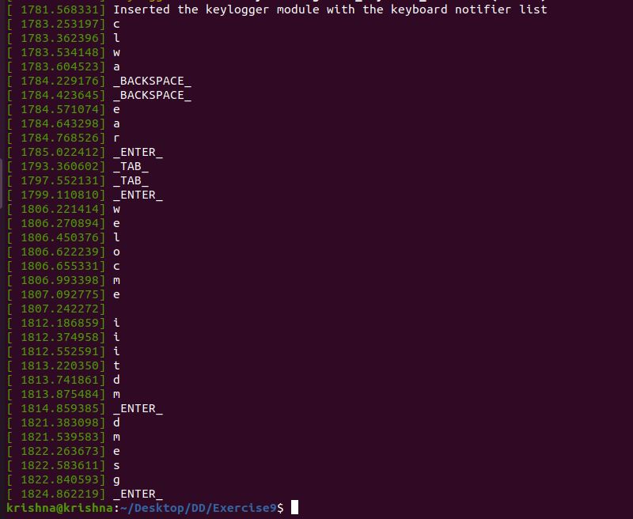

# Exercise - 9
Write a C program, keyboard logger, to capture keyboard strokes, through which we can capture typed passwords.
# Overview
Whenever a key is pressed keylogger_notify is called.Here in function we are first checking if shift key is pressed or not and then with param->down checking that is key pressed or released and with the help param->value we are mapping the keys and printing in kernel log.

**notifier_call** : This is a pointer to the callback function that will be called once an event happens.

**KBD_KEYCODE** - this events are always sent before other events, holding the keycode.

**param->down** - This variable can either be 0 or 1. If it is 1 it means that the key has been pressed and 0 means that the key has been released.

**param->value** - This variable will contain the actual data representation of the key pressed (i.e. 0x41 for A)

In order to compile and build the keylogger module; we need to create a Makefile.
```
krishna@krishna:~/Module$ make
```
This commmand is used to compile the souce code keylogger.c to create a module called keylogger.ko
```
krishna@krishna:~/Module$ sudo insmod keylogger.ko
```
This command will call init_module() which is called when the module is inserted into the kernel or loaded to the kernel.
```
krishna@krishna:~/Module$ sudo rmmod keylogger.ko
```
This command will call cleanup_module() which is called just before the module is unloaded from the kernel.
# Ouput

This is kernel log when module is loaded printing the message.