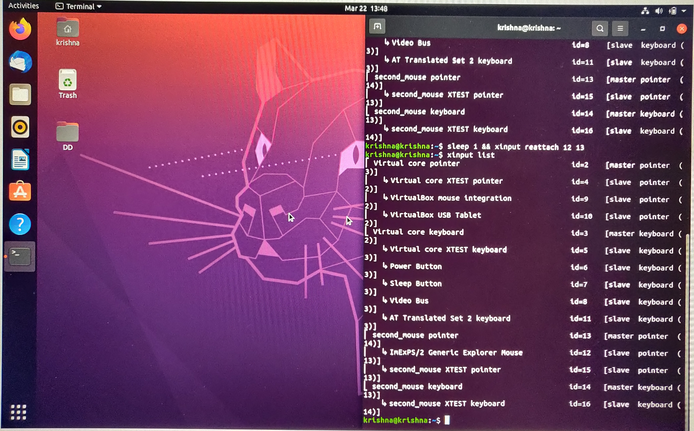

# Exercise - 4
To have two mouse cursors on monitor
# Overview
```
krishna@krishna:~/Desktop/DD/Lab-2/q4$ xinput list
```
This commmand will list all the input devices connected.
```
krishna@krishna:~/Desktop/DD/Lab-2/q4$ xinput create-master second_mouse
```
This command will create a new pair of master devices named "second_mouse pointer" and "second_mouse keyboard".
```
krishna@krishna:~/Desktop/DD/Lab-2/q4$ sleep 1 && xinput reattach 12 13
```
This command will reattach my mouse(slave device) id=12 to its new master device second_mouse pointer id=13. As a result we see two cursors on the monitor.
# Ouput


