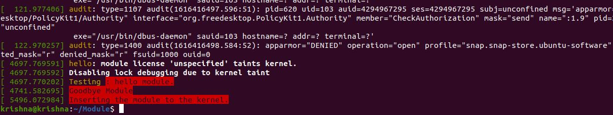
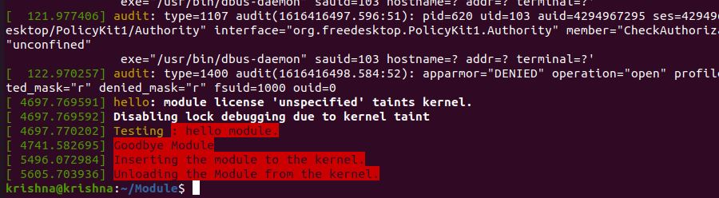

# Exercise - 5
Write a C program, compile it as module, insert into kernel, check message in log, remove module from kernel.
# Overview
We have implemented hello.c program which will be compiled as a kernel module. This module will print a message when we load the module and will also print a message when we unload the module.
```
krishna@krishna:~/Module$ make
```
This commmand is used to compile the souce code hello.c to create a module called hello.ko

```
krishna@krishna:~/Module$ sudo insmod hello.ko
```
This command will call init_module() which is called when the module is inserted into the kernel or loaded to the kernel.
```
krishna@krishna:~/Module$ sudo rmmod hello.ko
```
This command will call cleanup_module() which is called just before the module is unloaded from the kernel.
# Ouput

This is kernel log when module is loaded printing the message.

This is kernel log when module is unloaded printing the message.